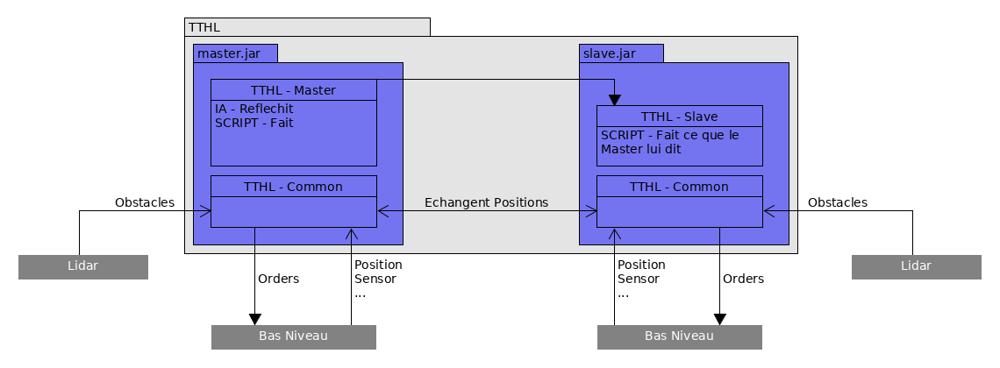

## TechTheHighLevel
Ce dépôt a pour but de reconstruire le code Haut Niveau (IA) d'Intech !

### Installation - IntelliJ
#### Prérequis
1. Installer Java (Par défaut sur beacoup de distribution)
2. Installer Maven (gestionnaire de dépendance, compilation, ...)

##### Si un projet est ouvert 
File -\> New... -\> Project from Existing Sources... -\> Import Project from external models (Maven)

Laissez tout par défaut
##### Si sur la fenêtre de démarrage 
Import Project -\> Choisir le dossier du dépôt cloné -\> Import Project from external models (Maven)

Laissez tout par défaut

#### Installer les dépendances
Alt+F12 pour ouvrir le terminal : 

    mvn clean install -DskipTests

Vous êtes parrés pour naviguer dans le HL !

### Architecture générale
Le HL est composé de trois modules Maven :
    
* **TTHL-common** : Socle commun aux codes des deux robots, il regroupe la gestion des données des capteurs, la gestion
    des mouvements du robot et la gestion des ordres à envoyer au LL
    
* **TTHL-master** : IA du robot principal, il concentre toutes les décisions stratégiques

* **TTHL-slave** : IA du robot secondaire

#### TTHL-common

L'architecture de ce projet est orientée micro-services : l'IA se base sur plusieurs modules qui ont tous une tâche bien
définie, et qui communiquent entre eux si besoin. Elle est construite de manière à ce qu'elle soit maintenable, 
performante (dans la limite du language utilisé), et tolérante aux fautes (voir norme ISO/IEC 25010).

Dans le dossier des sources, plusieurs packages regroupent les classes par fonctionnalités :
* Utils : il contient tous les utilitaires du code, tels que le service de Log, la Config, ou encore le Container, 
  qui permettent de faciliter la programmation du HL et de l'IA. (
  Ce paragraphe présente l'architecture d'une manière assez générale, pour plus de détails concernant chaque package, je
  vous invite à voir le paragraphe suivant "Architecture détaillée" qui détaille plus les classes évoquées.
  )La particularité des classes qui sont rangées dans ce
  package est qu'elles peuvent être utilisées pour d'autres projets puisqu'elles sont globalement indépendantes du HL, 
  à quelques exceptions près.
  
* Connection : ce petit package contient simplement les interfaces de communication que l'on souhaite créer avec 
  l'extérieur, ainsi qu'un service de gestion de ces dernières. Actuellement, elle sont au nombre de cinq : la Teensy 
  pour communiquer avec le Bas Niveau, la Raspi pour communiquer avec le Haut Niveau Maître/Esclave, le processus
  s'occupant du Lidar et deux LocalHost servant à effectuer des tests d'intégrité du HL.
  
* Orders : un peu plus étoffé que le précédent, ce package regroupe toutes les classes permettant de discuter avec le Bas
  Niveau sans avoir à s'occuper du côté de la table sur lequel navigue notre robot, et surtout sans avoir
  d'incompréhension lorsque l'on parle à ce cher Bas Niveau. Il offre aux autres modules, via la classe principale
  OrderWrapper les méthodes permettant d'envoyer tous les ordres que le Bas Niveau gère.
  
* Data : le plus gros package, et sans doute le plus complexe du HL, il regroupe toutes les données provenant de 
  l'extérieur, à savoir celles du Lidar ou des capteurs infrarouges Sick par exemple, ainsi que les contrôleurs qui
  récupèrent ces données et les traitent afin qu'elles soient utilisables par tous les autres modules du HL. Par exemple, 
  le Lidar Controler s'occupe de positionner les obstacles sur la Table et de mettre à jour le Graphe. Ces deux dernières
  classes, également dans le package data, définissent également comment est-ce que l'on représente la table afin que
  l'on puisse aisément s'y déplacer !
  
* Locomotion : dernier package à ce jour, ce module un peu plus haut niveau regroupe les fonctions permettant au robot
  de se déplacer en évitant si possible l'adversaire et les collisions avec les bords de la table et les obstacles
  
L'orchestration de tous ces packages et modules se fait de la manière suivante :

#### TTHL-master
#### TTHL-slave

### Architecture détaillée
Prenez une grande inspiration, on rentre ici dans le détail de l'architecture !
#### TTHL-common
##### Utils 
* **Log**

Le service de log est une enum : chaque instance représente un canal de journalisation que l'on peut activer et
désactiver au besoin, le but étant d'éviter de surcharger le terminal d'informations lorsque l'on se concentre sur une
fonctionnalité du robot. Ce service est utilisé quand on souhaite débuger, il s'agit donc d'une surchouche de System.out.print. Il y a trois niveau de log : debug, warning, et critical. Ce dernier niveau de log s'affiche
toujours, que le canal spécifié soit activé ou non. Attention à bien initialiser log si le container n'est pas 
instancié !
Utilisation :
    
    Log.CANNAL.setActive(true);
    Log.CANNAL.debug("Debut de la methode A");  // Ca s'affiche !
    Log.CANNAL.setActive(false);
    Log.CANNAL.warning("Fin de la methode A");  // Ca ne s'affiche pas...
    Log.CANNAL.critical("AH GROS BUG");         // Ca s'affiche !
    

* **Config**

La config est une librairie externe utilisée pour changer des paramètres dans le Haut Niveau sans avoir à recompiler. Par 
exemple, le rayon du robot ennemi. Il a été developpé par PF Gimenez, un vieux d'Intech aujourd'hui docteur ! Bref, ce service est lui aussi géré par le 
container. Les paramètres que l'on veut manipuler/retirer/ajouter sont rassemblés dans l'enum ConfigData, qui contient
les valeurs des paramètres par défaut. Les valeurs chargées par le container à l'instanciation des services sont 
présentes dans le fichier config.txt. Attention à utiliser les mêmes clés et types entre le fichier texte et l'enum !

* **Container**

Le container fait office à la fois de factory .ie il instancie les services(toutes les classes qui implémentent l'interface Service), 
et de gestion des dépendances : lorsque  l'on demande un service via la méthode _getService(Class class)_, le container va instancier 
tous les paramètres du constructeur en tant que service s'ils n'ont pas déjà été instanciés. Utilisation :
    
    Container container = Container.getInstance("Master");
    MonService service = container.getService(MonService.class);
    
"Tu nous parles de service depuis tout à l'heure mais c'est quoi au juste un service ???"

Et bien c'est un **singleton** offrant des **fonctionnalités** bien définies ! Dans notre cas c'est une interface qui 
doit surcharger la méthode _public void updateConfig(Config config)_, qui permet justement de récupérer des valeurs de 
la config ! On entend par singleton une classe qui n'a qu'un seule instance. Exemple :

ConfigData.java :

    import pfg.config.ConfigInfo;
    
    public enum ConfigData implements ConfigInfo {
        PARAM_MONSERVICE(18)
        ;
    }
config/config.txt :

    ...
    PARAM_MONSERVICE =              24
    ...
MonService.java :

    import utils.container.Service
    
    public class MonService implements Service {
        private int param;
        public MonService(MonAutreService ah) {...}
        @Override
        public void updateConfig(Config config) {
            this.param = config.getInt(ConfigData.PARAM_MONSERVICE);
        }
    }

##### Connection
* **ConnectionManager**

Ce service sert à gérer des IO (Input Output) du HL, c'est-à-dire l'échange de messages entre le HL et le LL,
mais aussi avec le Lidar, et la communication Master-Slave. Il se base sur l'enum Connection qui répertorie les
connections du HL. Après avoir initialiser les connections à l'aide de la méthode _initConnections(Connection... connections)_,
on peut simplement envoyer et lire des messages grâce aux autres méthodes :

    import connection.ConnectionManager
    import connection.Connection

    public static void main(String[] args) {
        Container container = Container.getInstance("Master");
        ConnectionManager connectionManager = container.getService(ConnectionManager.class);

        connectionManager.initConnections(Connection.LOCALHOST_SERVER, Connection.LOCALHOST_CLIENT);
        Connection.LOCALHOST_SERVER.send("Hello !");
        Optional<String> m = Connection.LOCALHOST_CLIENT.read();
        String mess;
        if (m.isPresent()) {
            mess = m.get();
        }
    }

**ATTENTION** : Dans le HL, les connections sont initialisées dans le Listener ! (voir plus bas)

##### Orders
* **OrderWrapper**

L'order wrapper est un service servant à simplifier l'envoi d'ordres au bas niveau via des méthodes plus simples
d'utilisation. Par exemple, plutôt que de devoir écrire, à chaque fois que l'on veut envoyer au bas niveau l'ordre 
d'avancer d'une certaine distance _Connection.TEENSY_MASTER.send("d 100")_, on préfère utiliser une méthode
du style _orderWrapper.moveLenghtwise(100)_ ! C'est le premier intérêt de l'order wrapper. Pour cela on se base
sur des enums qui implémentent l'interface _orders.order.Order_, et qui typent les chaînes de caractères correspondant aux
ordres que l'on envoie au bas niveau. Regardez la classe _orders.order.MotionOrder_ ainsi que dans l'order wrapper
pour plus d'informations.

L'order wrapper ne s'occupe pas que de simplifier l'envoie d'ordre au bas-niveau, il est également en charge de
la symétrisation des ordres. Pour ne pas avoir à écrire deux version du code, une pour chaque côté de la table, le
haut niveau réfléchit toujours du même côté et symétrise les ordres envoyés au bas niveau si nécessaire. C'est
au niveau de l'order wrapper que cela se fait. Imaginons que le HL réfléchisse toujours du côté violet, et que
l'on utilise la méthode _moveToPoint(Vec2 point)_, avec _point\[x: 370, y: 800\] (voir en annexe pour le repère
de la table). Si l'on est du côté violet, l'order wrapper doit envoyé au LL la chaîne de caractères _"p 370 800"_.
Si l'on est du côté jaune, il envoie _"p -370 800"_.

"Et du coup comment je crée un ordre ?"

La première chose à faire est de se mettre d'accord avec le bas niveau sur la chaîne de caractère associé à l'ordre
et le format d'envoi si nécéssaire. Une fois ceci fait, c'est tout simple si c'est un actionneur !

orders.order.ActuatorsOrder.java:

    public enum ActuatorsOrder {
        ...
        MON_ORDRE_ACTIONNEUR("ordre LL", 100);
        MON_ORDRE_SYMETRIQUE("ordre LL 2", 100); // S'il a besoin d'être symétrisé
        ...
    }

Si l'ordre a besoin d'être symétrisé (si l'actionneur à bouger dépend du côté de la couleur qui nous a été attribuée) :

orders.SymmetrizedActuatorOrderMap.java:

    public class SymmetrizedActuatorOrderMap implement Service {
        ...
        private SymmetrizedActuatorOrderMap {
            correspondanceMap.put(ActuatorOrder.MON_ORDRE_ACTIONNEUR, ActuatorOrder.MON_ORDRE_SYMETRIQUE);
        }
        ...
    }

Voilà pour un ordre de type actionneur, la méthode _useActuator(ActuatorOrder order, boolean waitForCompletion)_
s'occupe du reste !

"Le reste ? Du genre l'entier à côté de la chaîne de caractère et le booléen waitForCompletion
dans le prototype de la méthode que t'as pas expliqué ?"

Ce petit entier est en fait le temps que le HL doit attendre pour que l'action se finisse. Si l'on ne met pas d'entier,
l'action est considérée comme immédiate et le HL va continuer sa réflexion et son envoi d'ordres au LL. Cela aboutit
souvent à des actions qui se déroulent en même temps, et ce n'est pas toujours souhaitable. Cependant il y a bien des
fois où c'est pratique de déplier/replier des actionneurs en même temps ! C'est pourquoi ce petit booléen
waitForCompletion existe dans le prototype de la méthode. Mis à false, le HL ne va pas attendre le temps indiqué
dans la classe _orders.order.ActuatorsOrder_ avant de passer à la suite.
* **HookFactory**

Le service HookFactory comme son nom l'indique, permet de créer des Hooks ! Un hook est tout simplement un mécanisme
qui permet d'effectuer une action en mouvement. C'est le LL qui s'occupe d'exécuter des hooks mais c'est le HL qui
crée les hooks et décide s'ils doivent être activés ou non. Pour créer un hook, rien de plus simple :

oders.hooks.HookNames.java:

    public enum HookNames {
        ...
        MON_HOOK(1, new VectCartesian(500, 400), 10, Math.PI/2, Math.PI/8, ActuatorsOrder.MON_ORDRE_ACTIONNEUR),
        ...
    }

Le hook est maintenant créé ! Mais il faut le configurer, c'est-à-dire dire au LL qu'il existe lors de l'exécution,
et l'activer. Par exemple dans la classe Main.java:

    public class Main {
        Container container;
        HookFactory factory;
        ...
        public static void main(String[] args) {
            container = Container.getInstance("Master");
            factory = container.getService(HookFactory.class);
            ...
            factory.configureHook(HookNames.MON_HOOK);
            factory.enableHook(HookNames.MON_HOOK);
            ...
            // Do what you want !
        }
    }

##### Data
* **Table**

Cette classe représente la table et contient donc les obstacles et tout ce qu'on peut faire avec, les supprimer ou les
bouger par exemple. Cette classe s'appuie donc sur la classe Obstacle est ses classes filles. La principale modification
effectuée dans cette classe est l'ajout des obstacles fixes (les élements de jeu dont on connait la position exacte au top
départ)

    public class Table {
        ...
        private void initObstacle() {
            StillRectangularObstacle monObstacle = new StillRectangularObstacle(
                new VectCartesian(0, 1800), 1600 + 2* this.robotRay, 300 + 2* this.robotRay);
            this.fixedObstacles.add(monObstacle);
        }
        ...
    }

* **Graphe**
* **SensorState**
* **XYO**
* **Controlers & Listener**

##### Locomotion
* **PathFollower**
* **PathFinder**

#### TTHL-master
#### TTHL-slave
    
### Tests
Les tests, indispensables pour la maintenabilité du HL, et permettant d'être efficace pour trouver l'origine de vos bugs
lorsque vous développez de nouvelles fonctionnalités, sont découpés ici en trois packages :

* **Unitaires** : ce sont les tests de fonctionnalités qui ne dépendent d'aucune autre fonctionnalité ! Typiquement tout
  ce qu'il y a dans le package utils. Ils servent tout simplement à vérifier que les fonctionnalités de base n'ont pas
  été altérées par quelques curieux : si ces tests ne passent pas, rien ne fonctionnera correctement

* **Validation** : ces tests sont plus nombreux et plus complexes. Il servent à vérifier l'intégrité des 
  fonctionnalités testables sans le hardware, principalement celles du package data dans notre cas. Par exemple, on 
  vérifie que la méthode de mise à jour du graphe à partir de points données par le Lidar donne des résultats sans 
  fautes, c'est-à-dire que les obstacles sont correctement placés et que les arêtes parcourables du Graphe ne traverse 
  pas ces obstacles.
  
* **Embedded** : ces tests sont ceux réalisés en conditions réelles, c'est-à-dire avec un vrai robot ! Ce sont ceux que vous 
  devrez sans doute beaucoup toucher puisqu'ils doivent assurer toute la fonctionnalité du Robot : **GAGNER**
  
Ces tests sont destinés à être exécutés quotidiennement par un bot Jenkins (excépté pour les réels), vous permettant de 
vite voir si un bug a été introduit par une feature et d'indentifier plus rapidement son origine.

### Annexes
**TODO** : Plan de la table + umls