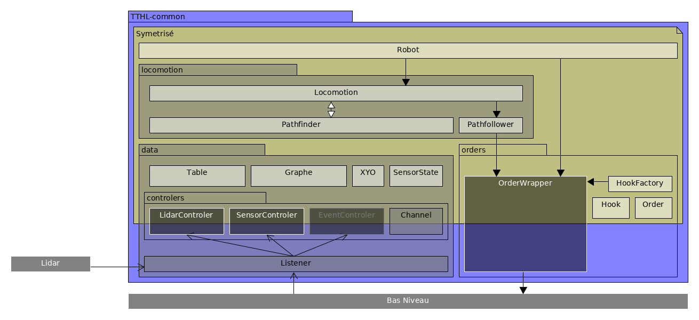
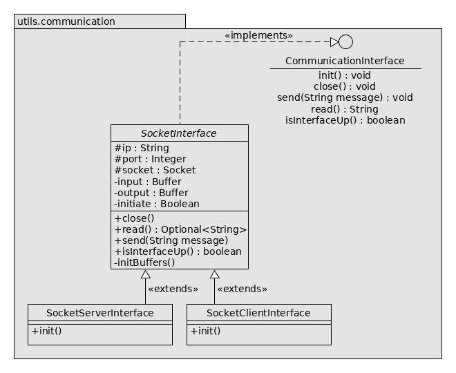
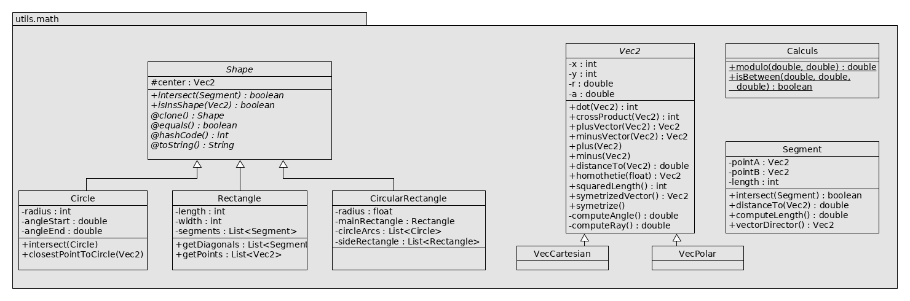
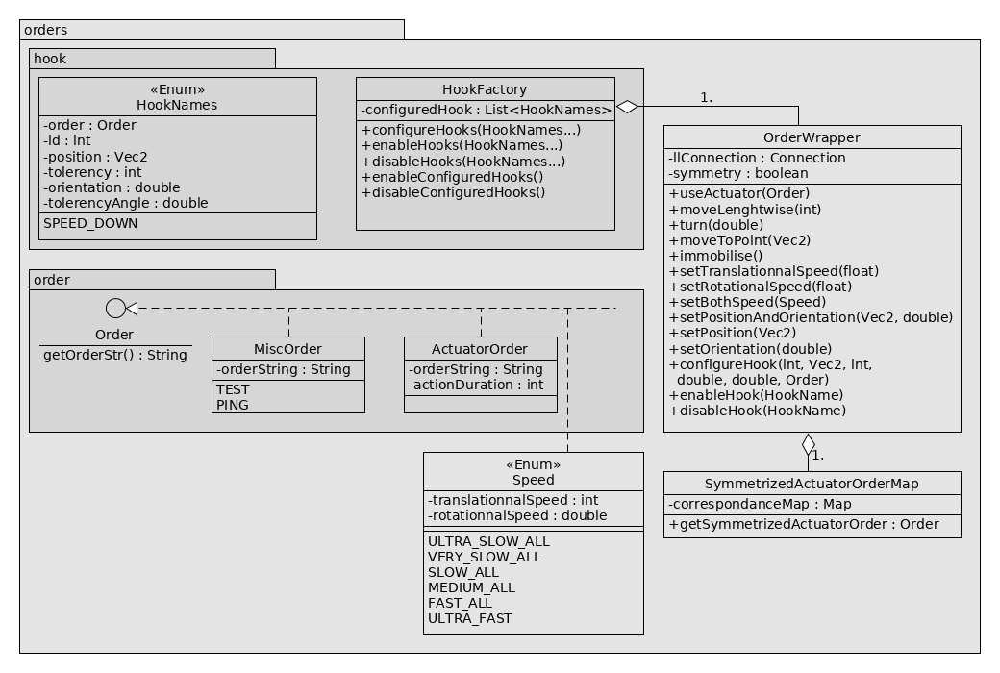
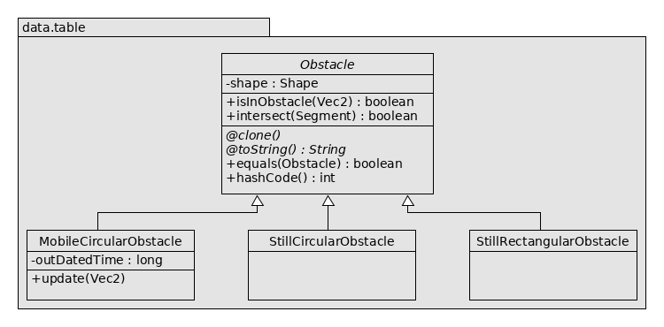
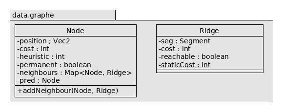
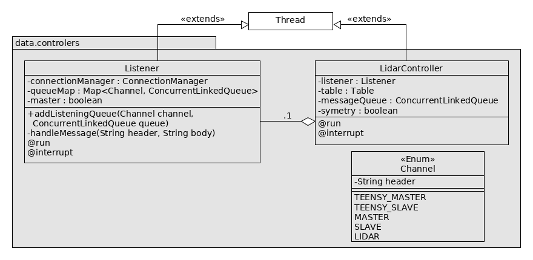
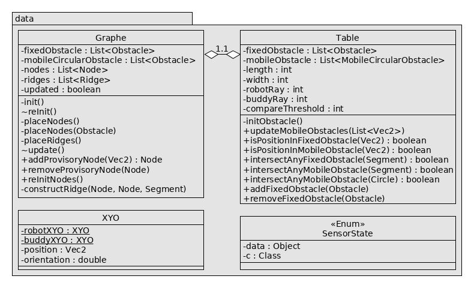
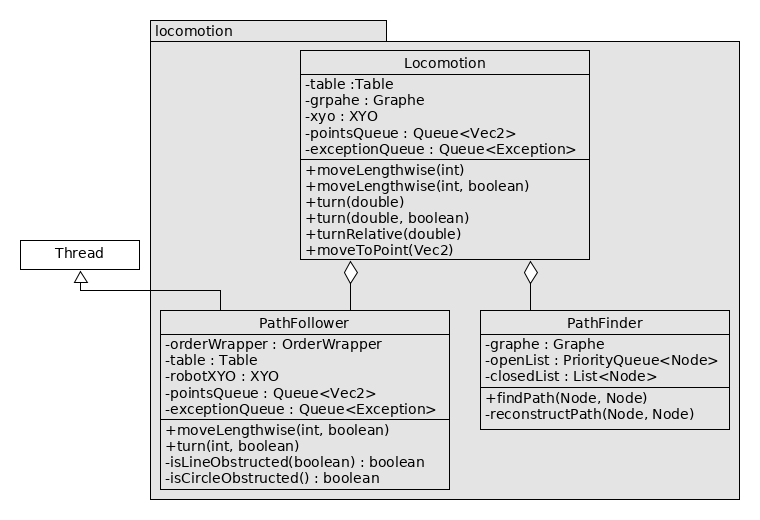

# TechTheTachion-HighLevel - T3HL

Code de l'année 2019 

### TODO
* [x] Découvrir le HL et sa doc
* [x] Scripts
* [?] Cas particulier pathfinding
* [x] Créer les ordres (avec le LL)
* [x] S'occuper du recalage avec les sicks (commencer par voir les maths)
* [x] Com avec l'électron
* [x] Tester la COM LL <-> HL
* [x] Tester la COM master <-> slave
* [x] Test LIDAR + Pathfinging
* [ ] IA

## Setup sur le robot
1. Cloner le repo sur la Rapsi
2. Lancer le script 'setup' dans le dossier racine du projet
3. ???
4. Profit. Tout est déjà fait!

## Installation - IntelliJ
### Prérequis
1. Installer Java (Par défaut sur beacoup de distribution)
2. Installer Maven (gestionnaire de dépendance, compilation, ...)

#### Si un projet est ouvert 
File -\> New... -\> Project from Existing Sources... -\> Import Project from external models (Maven)

Laissez tout par défaut
#### Si sur la fenêtre de démarrage 
Import Project -\> Choisir le dossier du dépôt cloné -\> Import Project from external models (Maven)

Laissez tout par défaut

### Installer les dépendances
Alt+F12 pour ouvrir le terminal : 
```bash
mvn clean install -DskipTests
```

### Installer les plugins
File -\> Settings... -\> Plugins

Installer les plugins Checkstyle-IDEA et MarkDown Navigator (ou MarkDown support)

Redémarrer IntelliJ et revenir dans File -\> Settings... -\> Checkstyle

Sous _Configuration File_, ajouter le fichier _resources/intcheckstyle.xml_

Vous êtes parrés pour naviguer dans le HL !

## Architecture générale
Le HL est composé de trois modules Maven :
    
* **T3HL-common** : Socle commun aux codes des deux robots, il regroupe la gestion des données des capteurs, la gestion
    des mouvements du robot et la gestion des ordres à envoyer au LL
    
* **T3HL-master** : IA du robot principal, il concentre toutes les décisions stratégiques

* **T3HL-slave** : IA du robot secondaire

* **T3HL-simulator** : Simulateur du LL permettant de faire tourner le HL

### T3HL-common

L'architecture de ce projet est orientée micro-services : l'IA se base sur plusieurs modules qui ont tous une tâche bien
définie, et qui communiquent entre eux si besoin. Elle est construite de manière à ce qu'elle soit maintenable, 
performante (dans la limite du language utilisé), et tolérante aux fautes (voir norme ISO/IEC 25010).

Dans le dossier des sources, plusieurs packages regroupent les classes par fonctionnalités :
* Utils : il contient tous les utilitaires du code, tels que le module de Log, la Config, ou encore le Container, 
  qui permettent de faciliter la programmation du HL et de l'IA. (
  Ce paragraphe présente l'architecture d'une manière assez générale, pour plus de détails concernant chaque package, je
  vous invite à voir le paragraphe suivant "Architecture détaillée" qui détaille plus les classes évoquées.
  )La particularité des classes qui sont rangées dans ce
  package est qu'elles peuvent être utilisées pour d'autres projets puisqu'elles sont globalement indépendantes du HL, 
  à quelques exceptions près.
  
* Connection : ce petit package contient simplement les interfaces de communication que l'on souhaite créer avec 
  l'extérieur, ainsi qu'un module de gestion de ces dernières. Actuellement, elle sont au nombre de cinq : la Teensy 
  pour communiquer avec le Bas Niveau, la Raspi pour communiquer avec le Haut Niveau Maître/Esclave, le processus
  s'occupant du Lidar et deux LocalHost servant à effectuer des tests d'intégrité du HL.
  
* Orders : un peu plus étoffé que le précédent, ce package regroupe toutes les classes permettant de discuter avec le Bas
  Niveau sans avoir à s'occuper du côté de la table sur lequel navigue notre robot, et surtout sans avoir
  d'incompréhension lorsque l'on parle à ce cher Bas Niveau. Il offre aux autres modules, via la classe principale
  OrderWrapper les méthodes permettant d'envoyer tous les ordres que le Bas Niveau gère.

* Data : le plus gros package, et sans doute le plus complexe du HL, il regroupe toutes les données provenant de 
  l'extérieur, à savoir celles du Lidar ou des capteurs infrarouges Sick par exemple, ainsi que les contrôleurs qui
  récupèrent ces données et les traitent afin qu'elles soient utilisables par tous les autres modules du HL. Par exemple, 
  le Lidar Controler s'occupe de positionner les obstacles sur la Table et de mettre à jour le Graphe. Ces deux dernières
  classes, également dans le package data, définissent également comment est-ce que l'on représente la table afin que
  l'on puisse aisément s'y déplacer !
  
* Locomotion : ce module un peu plus haut niveau regroupe les fonctions permettant au robot
  de se déplacer en évitant si possible l'adversaire et les collisions avec les bords de la table et les obstacles

* Scripts : ce package regroupe les classes abstraites et interfaces definissant le fonctionnement d'un script ! Un script
  est une suite d'action à faire pour le robot, implémentée dans la methode _Script.execute_.

L'orchestration de tous ces packages et modules se fait de la manière suivante (attention les noms ont pu changer depuis):




**Pour une vue plus précise, voir les annexes. Il existe un MEMO uml si besoin (doc/MEMO.md)**

### T3HL-master
### T3HL-slave

## Architecture détaillée
Prenez une grande inspiration, on rentre ici dans le détail de l'architecture !
### T3HL-common
#### Utils 
* **Log**

Le module de log est une `enum` : chaque instance représente un canal de journalisation que l'on peut activer et
désactiver au besoin, le but étant d'éviter de surcharger le terminal d'informations lorsque l'on se concentre sur une
fonctionnalité du robot. Ce module est utilisé quand on souhaite débuger, il s'agit donc d'une surchouche de System.out.print.
Il y a trois niveau de log : debug, warning, et critical. Ce dernier niveau de log s'affiche toujours, que le canal
spécifié soit activé ou non. Attention à bien initialiser log si le container n'est pas instancié !
Utilisation :
```Java
Log.CANNAL.setActive(true);
Log.CANNAL.debug("Debut de la methode A");  // Ca s'affiche !
Log.CANNAL.setActive(false);
Log.CANNAL.warning("Fin de la methode A");  // Ca ne s'affiche pas...
Log.CANNAL.critical("AH GROS BUG");         // Ca s'affiche !
```

* **Config**

La config est une librairie externe utilisée pour changer des paramètres dans le Haut Niveau sans avoir à recompiler. Par 
exemple, le rayon du robot ennemi. Il a été developpé par PF Gimenez, un vieux d'Intech aujourd'hui docteur ! Bref, ce module est lui
aussi géré par le container. Les paramètres que l'on veut manipuler/retirer/ajouter sont rassemblés dans l'enum ConfigData, qui contient
les valeurs des paramètres par défaut. Les valeurs chargées par le container à l'instanciation des services sont 
présentes dans le fichier `config.txt`. Attention à utiliser les mêmes clés et types entre le fichier texte et l'enum !

* **Container**

Le container fait office à la fois de factory .ie il instancie les services(toutes les classes qui implémentent l'interface Service), 
et de gestion des dépendances : lorsque  l'on demande un module via la méthode `getService(Class class)`, le container va
instancier tous les paramètres du constructeur en tant que module s'ils n'ont pas déjà été instanciés. Utilisation :
```Java
HLInstance hl = HLInstance.getInstance(Robots.MASTER);
MonModule module = hl.module(MonModule.class);
```
"Tu nous parles de module depuis tout à l'heure mais c'est quoi au juste un module ???"

Et bien c'est un **singleton** offrant des **fonctionnalités** bien définies ! Dans notre cas c'est une interface qui 
doit surcharger la méthode `updateConfig(Config config)`, qui permet justement de récupérer des valeurs de la config !
On entend par singleton une classe qui n'a qu'un seule instance. Exemple :

ConfigData.java :
```Java
import pfg.config.ConfigInfo;
    
public enum ConfigData implements ConfigInfo {
    PARAM_MONSERVICE(18)
    ;
}
```
config/config.txt :
```
...
PARAM_MONSERVICE =              24
...
```
    
MonService.java :
```Java
import utils.container.Module
    
public class MonService implements Service {
    private int param;
    public MonService(MonAutreService ah) {...}
    @Override
    public void updateConfig(Config config) {
        this.param = config.getInt(ConfigData.PARAM_MONSERVICE);
    }
}
```

#### Connection
* **ConnectionManager**

Ce module sert à gérer des IO (Input Output) du HL, c'est-à-dire l'échange de messages entre le HL et le LL,
mais aussi avec le Lidar, et la communication Master-Slave. Il se base sur l'enum Connection qui répertorie les
connections du HL. Après avoir initialiser les connections à l'aide de la méthode `initConnections(Connection... connections)`,
on peut simplement envoyer et lire des messages grâce aux autres méthodes :
```Java
import connection.ConnectionManager
import connection.Connection

public static void main(String[] args) {
    Container container = Container.getInstance("Master");
    ConnectionManager connectionManager = container.getService(ConnectionManager.class);

    connectionManager.initConnections(Connection.LOCALHOST_SERVER, Connection.LOCALHOST_CLIENT);
    Connection.LOCALHOST_SERVER.send("Hello !");
    Optional<String> m = Connection.LOCALHOST_CLIENT.read();
    String mess;
    if (m.isPresent()) {
        mess = m.get();
    }
}
```

**ATTENTION** : Dans le HL, les connections sont initialisées dans le `Listener` ! (voir plus bas)

#### Orders
* **OrderWrapper**

L'order wrapper est un module servant à simplifier l'envoi d'ordres au bas niveau via des méthodes plus simples
d'utilisation. Par exemple, plutôt que de devoir écrire, à chaque fois que l'on veut envoyer au bas niveau l'ordre 
d'avancer d'une certaine distance `Connection.TEENSY_MASTER.send("d 100")`, on préfère utiliser une méthode
du style `orderWrapper.moveLenghtwise(100)` ! C'est le premier intérêt de l'order wrapper. Pour cela on se base
sur des enums qui implémentent l'interface `lowlevel.order.Order`, et qui typent les chaînes de caractères correspondant aux
ordres que l'on envoie au bas niveau. Regardez la classe `orders.order.MotionOrders` ainsi que dans l'order wrapper
pour plus d'informations.

L'order wrapper ne s'occupe pas que de simplifier l'envoie d'ordre au bas-niveau, il est également en charge de
la symétrisation des ordres. Pour ne pas avoir à écrire deux version du code, une pour chaque côté de la table, le
haut niveau réfléchit toujours du même côté et symétrise les ordres envoyés au bas niveau si nécessaire. C'est
au niveau de l'order wrapper que cela se fait. Imaginons que le HL réfléchisse toujours du côté violet, et que
l'on utilise la méthode `moveToPoint(Vec2 point)`, avec point\[x: 370, y: 800\] (voir en annexe pour le repère
de la table). Si l'on est du côté violet, l'order wrapper doit envoyé au LL la chaîne de caractères `"p 370 800"`.
Si l'on est du côté jaune, il envoie `"p -370 800"`.

"Et du coup comment je crée un ordre ?"

La première chose à faire est de se mettre d'accord avec le bas niveau sur la chaîne de caractère associé à l'ordre
et le format d'envoi si nécéssaire. Une fois ceci fait, c'est tout simple si c'est un actionneur !

orders.order.ActuatorsOrder.java:
```Java
public enum ActuatorsOrder {
    ...
    MON_ORDRE_ACTIONNEUR("ordre LL", 100);
    MON_ORDRE_SYMETRIQUE("ordre LL 2", 100); // S'il a besoin d'être symétrisé
    ...
}
```

Si l'ordre a besoin d'être symétrisé (si l'actionneur à bouger dépend du côté de la couleur qui nous a été attribuée) :

orders.SymmetrizedActuatorOrderMap.java:
```Java
public class SymmetrizedActuatorOrderMap implement Service {
    ...
    private SymmetrizedActuatorOrderMap {
        correspondanceMap.put(ActuatorOrder.MON_ORDRE_ACTIONNEUR, ActuatorOrder.MON_ORDRE_SYMETRIQUE);
    }
    ...
}
```

Voilà pour un ordre de type actionneur, la méthode `useActuator(ActuatorOrder order, boolean waitForCompletion)`
s'occupe du reste !

"Le reste ? Du genre l'entier à côté de la chaîne de caractère et le booléen waitForCompletion
dans le prototype de la méthode que t'as pas expliqué ?"

Ce petit entier est en fait le temps que le HL doit attendre pour que l'action se finisse. Si l'on ne met pas d'entier,
l'action est considérée comme immédiate et le HL va continuer sa réflexion et son envoi d'ordres au LL. Cela aboutit
souvent à des actions qui se déroulent en même temps, et ce n'est pas toujours souhaitable. Cependant il y a bien des
fois où c'est pratique de déplier/replier des actionneurs en même temps ! C'est pourquoi ce petit booléen
waitForCompletion existe dans le prototype de la méthode. Mis à false, le HL ne va pas attendre le temps indiqué
dans la classe `orders.order.ActuatorsOrder` avant de passer à la suite.
* **HookFactory**

Le module HookFactory comme son nom l'indique, permet de créer des Hooks ! Un hook est tout simplement un mécanisme
qui permet d'effectuer une action en mouvement. C'est le LL qui s'occupe d'exécuter des hooks mais c'est le HL qui
crée les hooks et décide s'ils doivent être activés ou non. Pour créer un hook, rien de plus simple :

oders.hooks.HookNames.java:
```Java
public enum HookNames {
    ...
    MON_HOOK(1, new VectCartesian(500, 400), 10, Math.PI/2, Math.PI/8, ActuatorsOrder.MON_ORDRE_ACTIONNEUR),
    ...
}
```

Le hook est maintenant créé ! Mais il faut le configurer, c'est-à-dire dire au LL qu'il existe lors de l'exécution,
et l'activer. Par exemple dans la classe Main.java:
```Java
public class Main {
    Container container;
    HookFactory factory;
    ...
    public static void main(String[] args) {
        container = Container.getInstance("Master");
        factory = container.getService(HookFactory.class);
        ...
        factory.configureHook(HookNames.MON_HOOK);
        factory.enableHook(HookNames.MON_HOOK);
        ...
        // Do what you want !
    }
}
```
#### Data
* **Table**

Cette classe représente la table et contient donc les obstacles et tout ce qu'on peut faire avec, les supprimer ou les
bouger par exemple. Cette classe s'appuie donc sur la classe Obstacle est ses classes filles. La principale modification
effectuée dans cette classe est l'ajout des obstacles fixes (les élements de jeu dont on connait la position exacte au top
départ)
```Java
public class Table {
    ...
    private void initObstacle() {
        StillRectangularObstacle monObstacle = new StillRectangularObstacle(
            new VectCartesian(0, 1800), 1600 + 2* this.robotRay, 300 + 2* this.robotRay);
        this.fixedObstacles.add(monObstacle);
    }
    ...
}
```
* **Graphe**

Le Graphe sert à paramétrer la table pour qu'elle soit plus facilement navigable : on la modélise sous forme de noeuds,
qui ont des positions, et d'arrêtes, qui sont des segments reliant des noeuds. Cela sert à représenter des trajectoires
que le robot peut parcourir sans rencontrer d'obstacle fixe ! Ces arrêtes sont mise à jour par le Lidar Controler qui
spécifie pour chaque arrête si elle est parcourable ou non à chaque scan reçu par le Lidar. C'est cette classe qui sert
de support à la réflexion pour le parcours de la table en évitant tous les obstacles.

* **SensorState**

Cette enum regroupe l'état des capteurs du robots qui ne nécessite pas de traitement, comme des contacteurs ou certains
capteurs de présence. Pour ajouter un capteur, rien de plus simple, on spécifie son type :
```Java
public enum SensorState {
    EXEMPLE(1.8, Double.class),
    ;
}
```

* **XYO**

XYO représente une position et une orientation du robot. Elle contient deux champs statics accessibles partout dans le
code : XYO du robot, et celui du "buddy" (Master pour le Slave, Slave pour le Master). Elle permet tout simplement
d'englober Vecteur et double dans une seule classe.

* **Controlers & Listener**

Le listener est un module qui écoute toutes les données envoyées au HL, et les redistribus en fonctions du type de donnée,
indiqué par le header du message. Ces headers sont définis dans l'enum data.controlers.Channel, qui lie les chaînes de
caractère à un type enuméré (instance d'enum). Ces messages sont redistribués aux controlers, qui traitent et stockent
les données reçues. Un controler "s'abonne" à un cannal via le Listener pour recevoir et traiter les données :
data.controlers.Channel.java :
```Java
public enum Channel {
    MY_CHANNEL((char) 0x28, (char) 0x22),
    ;
}
```

data.controlers.MonControler.java :
```Java
public class MonContoler extends Thread implement Service {
    ...
    private boolean symetry;
    private ConcurrentLinkedQueue<String> messageQueue;

    private MonControler(Listener listener) {
        messageQueue = new ConcurrentLinkedQueue<>();
        listener.addQueue(Channel.MY_CHANNEL, messageQueue);
    }

    ...
    @Override
    public void run() {
        ...
    }

    @Override
    public void updateConfig(Config config) {
        this.symetry = config.getString(ConfigInfoData.COLOR).equals("jaune");
    }
}
```

Les controlers ont aussi un rôle de symetrisation ! Il symetrise, si besoin, les données envoyées, afin que le HL s'y
retrouve.

#### Locomotion
* **PathFollower**

Le PathFollower est un module de suivit du chemin : ce module est chargé d'envoyer les ordres appropriés au bas niveau
et de vérifier que le trajectoire n'est pas obstruée au fur et à mesure que le robot avance. Pour cela il s'appuie sur
les données de la tables pour vérifier que le robot ne vas pas cogner un obstacle ou un robot adverse ! Si tel est le
cas lors du suivit d'un chemin, il le communique au module Pathfinder via une file de message. Il reçoit les points à
atteindre via une autre file de message.

* **PathFinder**

Le Pathfinder a pour rôle la recherche de chemins : le but, lorsque l'on veut atteindre un point, est de rechercher
periodiquement le plus court chemin entre le prochain point que l'on va atteindre et le point que l'on veut, in fine
atteindre. Cela permet d'anticiper les changements du graphe, i.e les mouvements de l'adversaires, et donc de les éviter !
Bien entendus, on ne peut pas tout voir dans le futur : c'est pourquoi il y a beaucoup de cas à traiter. Pour plus
d'informations, voir les commentaires.

### T3HL-master
A compléter...

### T3HL-slave
A compléter...

### T3HL-simulator
A compléter...
    
## Tests
Les tests, indispensables pour la maintenabilité du HL, et permettant d'être efficace pour trouver l'origine de vos bugs
lorsque vous développez de nouvelles fonctionnalités, sont découpés ici en trois packages :

* **Unitaires** : ce sont les tests de fonctionnalités qui ne dépendent d'aucune autre fonctionnalité ! Typiquement tout
  ce qu'il y a dans le package utils. Ils servent tout simplement à vérifier que les fonctionnalités de base n'ont pas
  été altérées par quelques curieux : si ces tests ne passent pas, rien ne fonctionnera correctement

* **Validation** : ces tests sont plus nombreux et plus complexes. Il servent à vérifier l'intégrité des 
  fonctionnalités testables sans le hardware, principalement celles du package data dans notre cas. Par exemple, on 
  vérifie que la méthode de mise à jour du graphe à partir de points données par le Lidar donne des résultats sans 
  fautes, c'est-à-dire que les obstacles sont correctement placés et que les arêtes parcourables du Graphe ne traverse 
  pas ces obstacles.
  
* **Embedded** : ces tests sont ceux réalisés en conditions réelles, c'est-à-dire avec un vrai robot ! Ce sont ceux que vous 
  devrez sans doute beaucoup toucher puisqu'ils doivent assurer toute la fonctionnalité du Robot : **GAGNER**
  
Ces tests sont destinés à être exécutés quotidiennement par un bot Jenkins (excépté pour les réels), vous permettant de 
vite voir si un bug a été introduit par une feature et d'indentifier plus rapidement son origine.

## Annexes
* **Utils** :





* **Orders** :



* **Data** :









* **Locomotion** :


